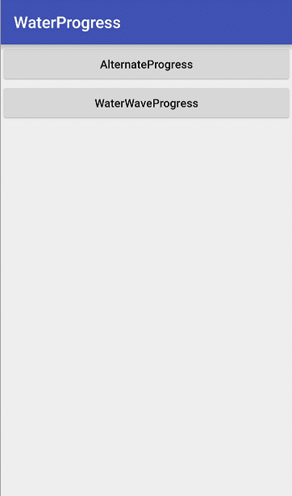
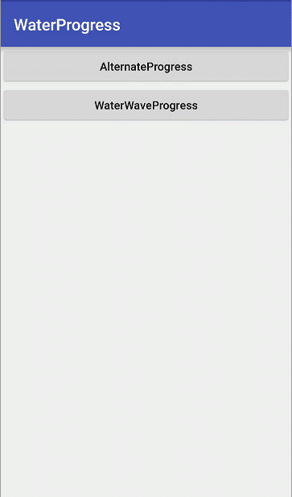

## WaterProgress

### screenshot

   <table align="center">
       <tr>
           <td></td>
           <td></td>
       </tr>
   </table>


### How to add dependency
- gradle

   1.Add it in your root build.gradle at the end of repositories.
   ```bash
   allprojects {
        repositories {
            ...
            maven { url 'https://jitpack.io' }
        }
    }
   ```
    Step 2. Add the dependency.
    ```bash
     dependencies {
        compile 'com.github.firefecker:WaterProgress:0.1.0'
     }

    ```

 - maven

    Step 1. Add the JitPack repository to your build file.
    ```bash
    <repositories>
        <repository>
            <id>jitpack.io</id>
            <url>https://jitpack.io</url>
        </repository>
    </repositories>
    ```
    Step 2. Add the dependency.
    ```bash
    	<dependency>
    	    <groupId>com.github.firefecker</groupId>
    	    <artifactId>WaterProgress</artifactId>
    	    <version>0.1.0</version>
    	</dependency>

    ```

### How to use

 - 1.AlternateProgress

 ```bash
    public class MainActivity extends AppCompatActivity{

        private AlternateProgress mWaterWaveProgress;

        private int count = 0;


        private Handler handler = new Handler() {
            @Override
            public void handleMessage(Message msg) {
                super.handleMessage(msg);
                if (msg.what == 1) {
                    count+=10;
                    init();
                    sendEmptyMessageDelayed(1,5000);
                }
            }
        };

        private void init() {
            mWaterWaveProgress.setTextValue(count+"");
        }

        @Override
        protected void onCreate(Bundle savedInstanceState) {
            super.onCreate(savedInstanceState);
            setContentView(R.layout.activity_main);
            mWaterWaveProgress = (AlternateProgress) findViewById(R.id.mWaterWaveProgress);
            polling();
            handler.sendEmptyMessageDelayed(1,5000);
        }

        private void polling() {
            mWaterWaveProgress.animateWave();
            mWaterWaveProgress.setContent("汽车已充电量(度)");
        }

    }
 ```

 - 2.WaterWaveProgress
 ```bash
    public class ThirdActivity extends AppCompatActivity{

        private WaterWaveProgress mWaterWaveProgress;

        private int count = 0;


        private Handler handler = new Handler() {
            @Override
            public void handleMessage(Message msg) {
                super.handleMessage(msg);
                if (msg.what == 1) {
                    count+=5;
                    if (count > 100 || count < 0) {
                        count = 0;
                    }
                    init();
                    sendEmptyMessageDelayed(1,5000);
                }
            }
        };


        @Override
        protected void onCreate(@Nullable Bundle savedInstanceState) {
            super.onCreate(savedInstanceState);
            setContentView(R.layout.activity_third);
            mWaterWaveProgress = (WaterWaveProgress) findViewById(R.id.mWaterWaveProgress);
            polling();
            handler.sendEmptyMessageDelayed(1,5000);
        }

        private void polling() {
            mWaterWaveProgress.animateWave();
            mWaterWaveProgress.setContent("当前汽车总电量");
        }

        private void init() {
            mWaterWaveProgress.setValue(count);
        }
    }

 ```